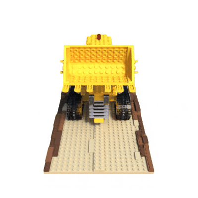
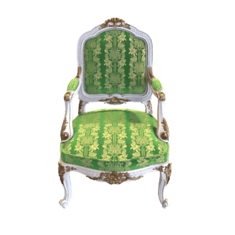
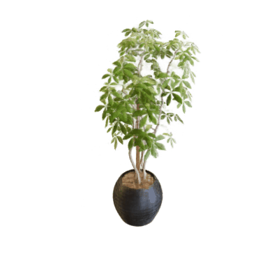

# Neural Radiance Fields

NeRF (Neural Radiance Fields) is a method that achieves state-of-the-art results for synthesizing novel views of complex scenes.

## Installation

```console
git clone https://github.com/bareform/dependencies.git
conda update -n base -c defaults conda
conda env create -f dependencies/environment.yml
conda activate bareform

git clone https://github.com/bareform/nerf.git
cd nerf
```

<details>
  <summary> Dependencies (click to expand) </summary>
  
  ## Dependencies
  - Python 3.10
  - imageio[ffmpeg]
  - numpy
  - torch
    
</details>

## Quick Start

To train a low-res `lego` NeRF:

```
python3 -m utils.trainer --config="./configs/lego.toml"
```

After training for 200K iterations, you can find results similiar to gif at `./assets/lego/lego.gif`.



Using the configuration provided at `./configs/lego.toml`, we achieve a final PSNR of 32.95.

To train a low-res `chair` NeRF:

```
python3 -m utils.trainer --config="./configs/chair.toml"
```

After training for 200K iterations, you can find results similiar to gif at `./assets/chair/chair.gif`.



Using the configuration provided at `./configs/chair.toml`, we achieve a final PSNR of 34.31.

To train a low-res `ficus` NeRF:

```
python3 -m utils.trainer --config="./configs/ficus.toml"
```

After training for 200K iterations, you can find results similiar to gif at `./assets/ficus/ficus.gif`.



Using the configuration provided at `./configs/ficus.toml`, we achieve a final PSNR of 30.67.

You can download the pre-trained models [here](https://huggingface.co/luethan2025/nerf) and use the provided Jupyter Notebook `inference.ipynb` to generate some videos.

## Method

[Representing Scenes as Neural Radiance Fields for View Synthesis](https://arxiv.org/abs/2003.08934)

Ben Mildenhall<sup>1</sup>, Pratul P. Srinivasan<sup>1</sup>, Matthew Tancik<sup>1</sup>, Jonathan T. Barron<sup>2</sup>, Ravi Ramamoorthi<sup>3</sup>, Ren Ng<sup>1</sup>

<sup>1</sup>UC Berkeley, <sup>2</sup>Google Research, <sup>3</sup> UC San Diego

> We present a method that achieves state-of-the-art results for synthesizing novel views of complex scenes by optimizing an underlying continuous volumetric scene function using a sparse set of input views. Our algorithm represents a scene using a fully-connected (non-convolutional) deep network, whose input is a single continuous 5D coordinate (spatial location ($x$, $y$, $z$) and viewing direction ($\theta$, $\phi$)) and whose output is the volume density and view-dependent emitted radiance at that spatial location. We synthesize views by querying 5D coordinates along camera rays and use classic volume rendering techniques to project the output colors and densities into an image. Because volume rendering is naturally differentiable, the only input required to optimize our representation is a set of images with known camera poses. We describe how to effectively optimize neural radiance fields to render photorealistic novel views of scenes with complicated geometry and appearance, and demonstrate results that outperform prior work on neural rendering and view synthesis. View synthesis results are best viewed as videos, so we urge readers to view our supplementary video for convincing comparisons. 

## Citation

The original paper can be found at:
```
@misc{mildenhall2020nerf,
    title={NeRF: Representing Scenes as Neural Radiance Fields for View Synthesis},
    author={Ben Mildenhall and Pratul P. Srinivasan and Matthew Tancik and Jonathan T. Barron and Ravi Ramamoorthi and Ren Ng},
    year={2020},
    eprint={2003.08934},
    archivePrefix={arXiv},
    primaryClass={cs.CV}
}
```
